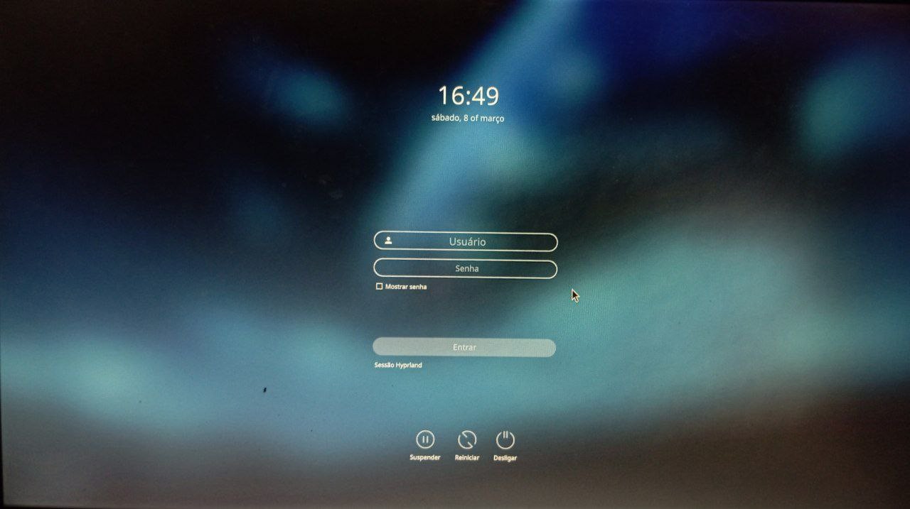

# hyprland-config-kit
Configurações para ambiente de hyprland.

- A pasta para configuração do sddm possui um nome: `usr-share`, para indicar que o conteúdo dela, vai dentro de usr/share/<cola a pasta ssdm desse repositorio>

- O arquivo dentro da pasta: `sddm/etc/sddm.conf` deve ser posto em `/etc/`

---

### base:
waybar: https://github.com/d00m1k/SimpleBlueColorWaybar
sddm theme: https://store.kde.org/p/1312658/

---

### hyprland:
  

### sddm:
  

---
